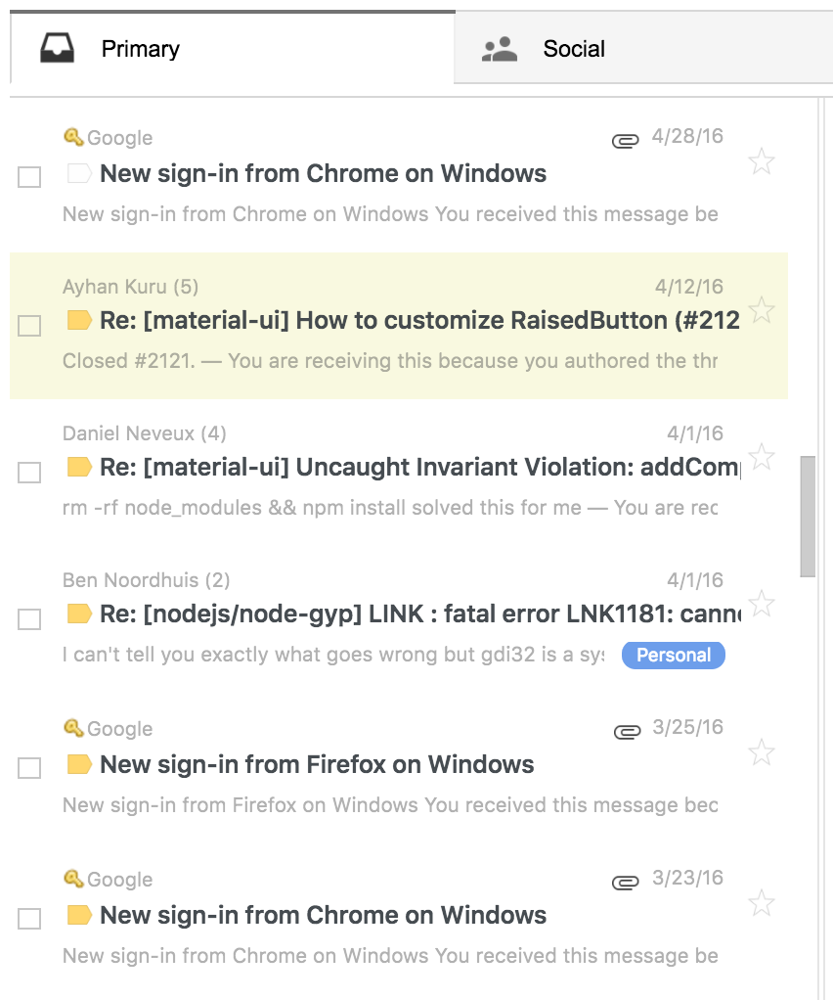

# Modern Gmail

Chrome plugin for making gmail a little prettier. Mostly just styling tweaks. 



## Usage

Clone this repository

```
$ git clone git@github.com:nickzuber/modern-gmail.git
```

Go to

```
chrome://extensions/
```

Turn on `Developer mode`

Press `Load unpacked extention...`

Load `modern-gmail` directory that you just cloned

And you're done! 

## Pro-Tips

In Gmail, go to `Settings`

Press `Labs`

Enable

 - Authentication icon for verified senders
 - Mark as Read Button
 - Preview Pane
 - Unread message icon

## License

This software is free to use under the MIT License. See this reference for license text and copyright information.
